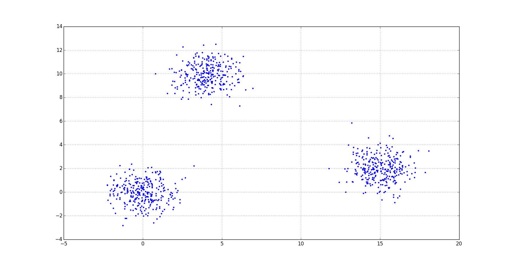
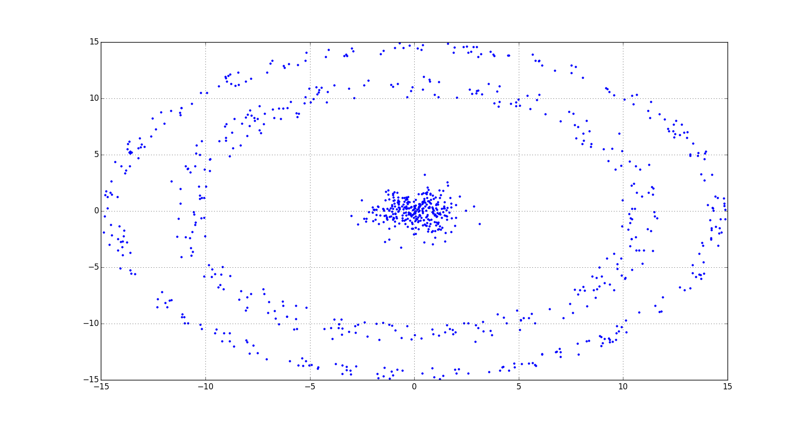
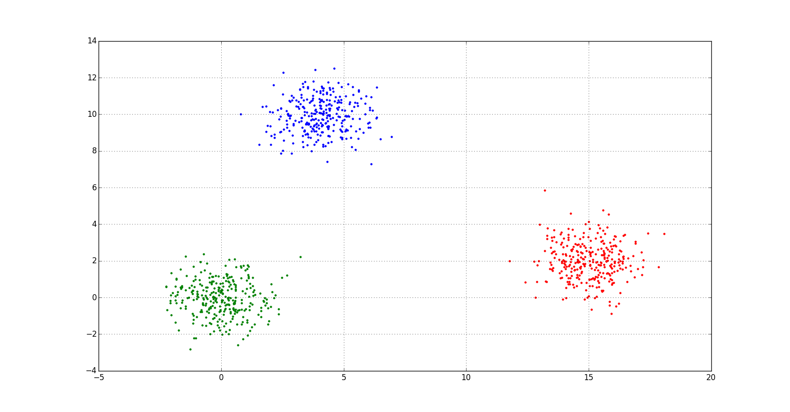
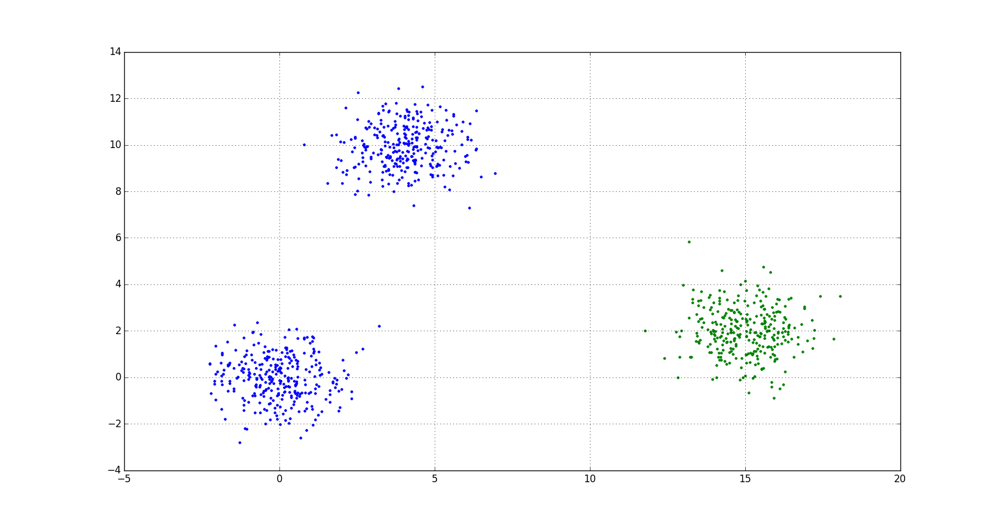
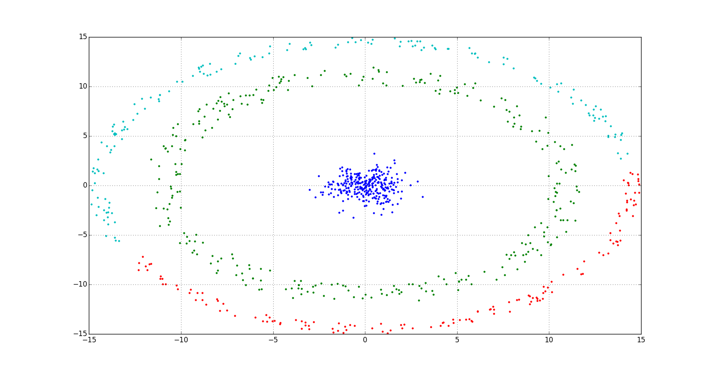
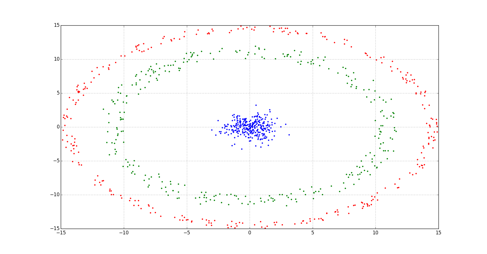
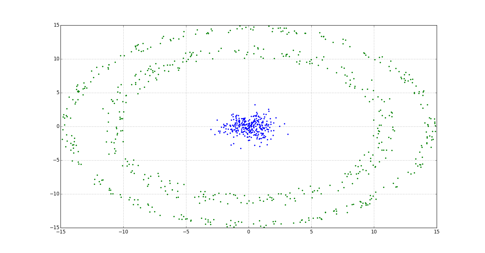

# Nearest Neighbor Search

## Description
A baseline method for clusterings.

>We are going to use this 2 data from this [project](https://github.com/rcv911/Cluster_generation): 



## Algorithm

+ User should determine the critical distance (manually)
```python
	dc = <number>
```
+ Using [Euclidean distance](https://en.wikipedia.org/wiki/Euclidean_distance) calculate matrix distance. 
Note, you can use another distance function like [Manhattan distance](https://en.wikipedia.org/wiki/Taxicab_geometry).
```python
	for i in range(N):
		for j in range(i+1, N):
			M[j, i] = M[i, j] = (sum((x[i, :]-x[j, :])**2))**0.5
```
+ Find 'embryo' -> the most closest dots
+ Find indexes - the minimum distance among all
+ 3 lists:
  + list 1 - long added points and their neighbors
  + list 2 - fresh points added in the last step. It needs find their neighbors
  + list 3 - this points is a new neighbors from list 2

Now, how it works with lists:
+ 1st step:
  + list 1 is empty
  + list 2 has 'embryo'
  + list 3 new neighbors

+ 2nd step:
  + list 2 is list 1 now
  + list 3 is list 2 now
  + list 3 is empty
 
+ etc.

## Results
> if dc = 5 we have 3 clusters

> if dc = 6 we have 2 clusters

> if dc = 7 we have 1 cluster

> if dc = 1.5 we have 4 clusters

> if dc = 2 we have 3 clusters

> if dc = 5 we have 2 clusters


## Learn more

- Source 1: [Wiki](https://en.wikipedia.org/wiki/Nearest_neighbor_search)
- Source 2: [Wiki2](https://wiki2.org/en/Nearest_neighbor_search)

## Projects

You can find another ready projects for analys like [QGIS](http://www.qgistutorials.com/en/docs/nearest_neighbor_analysis.html) 

## Installation

You can use [Python](https://www.python.org/) with data package: [Anaconda](https://www.anaconda.com/) or [Miniconda](https://conda.io/miniconda).
There's another way - use [Portable Python](http://portablepython.com/). Also you can use whatever IDE for Python.

## License

Free